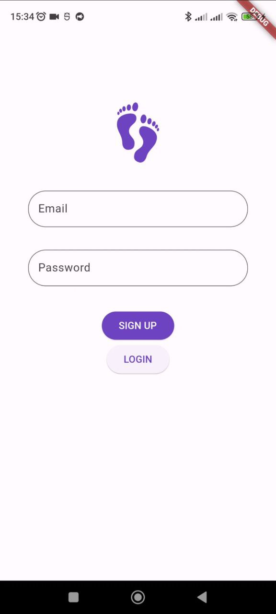

# stepper #

Step tracker Flutter app 

### USE ###

* BLOC
* Firestore as a DataBase
* Firebase to login/register
* [pedometer lib](https://pub.dev/packages/pedometer) to steps counting

### How to use ###

1) Run the app and grant permission to record activity
2) The program must have access to the Internet for correct operation
3) Register using your email and password

   
4) Enjoy :)

